### **Практическая работа №1**
## 1. Создание виртуальной машины

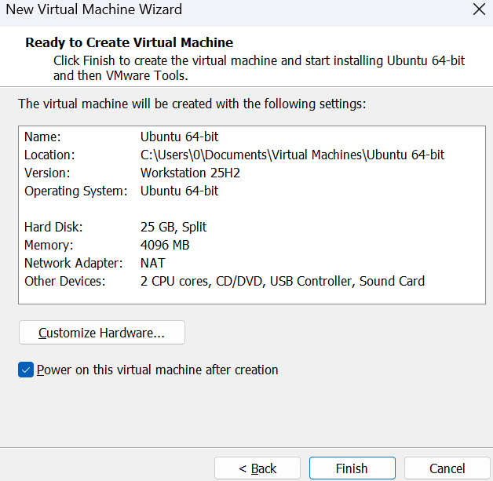

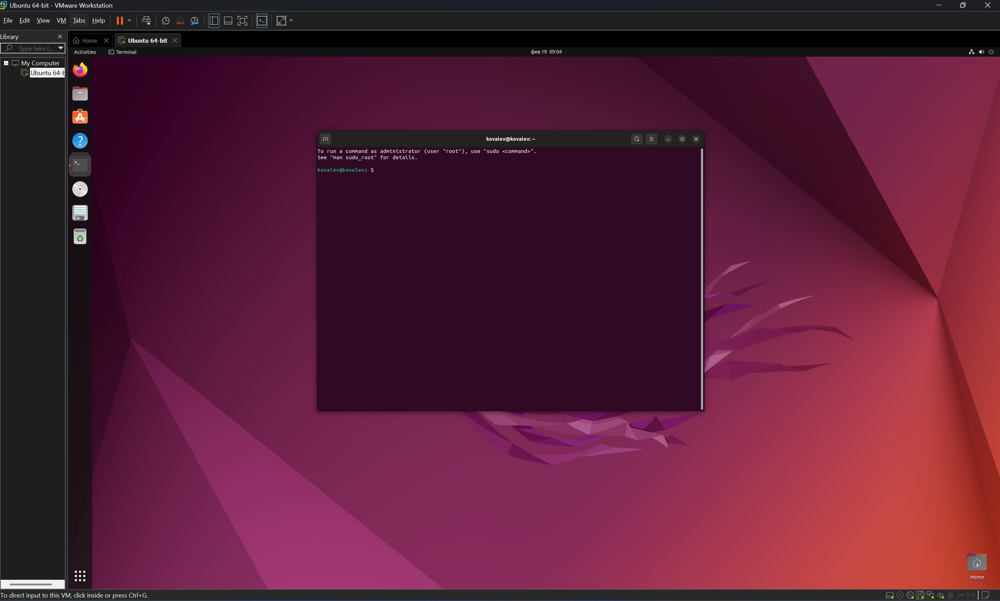

## 2. Информация о системе

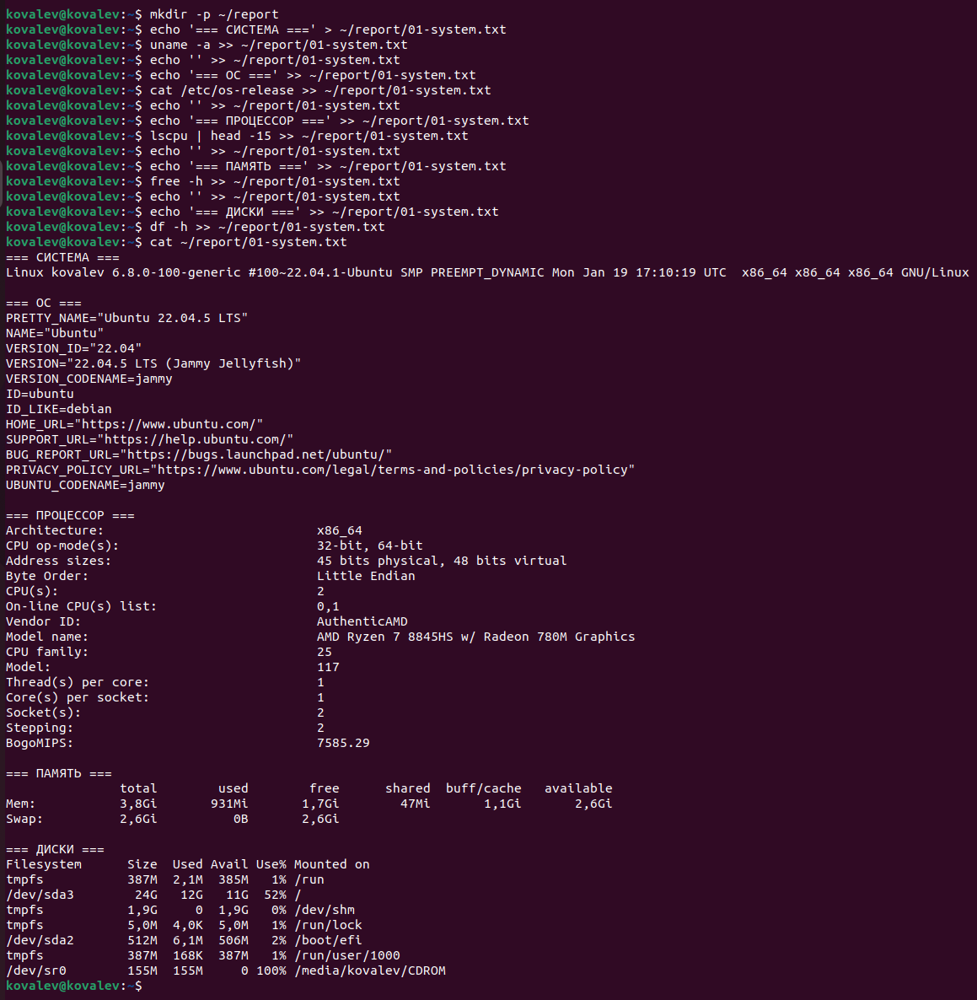

## 3. Сеть: IP-адрес и открытые порты

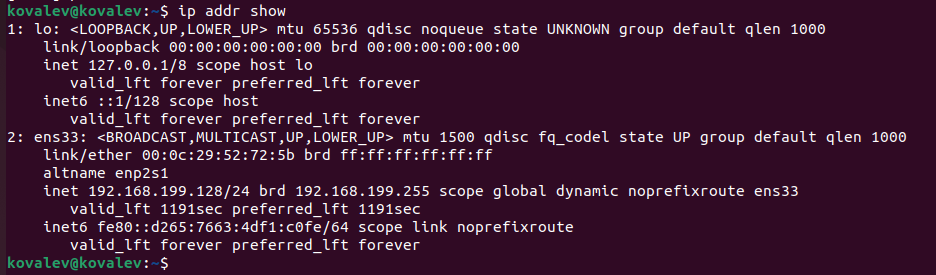

## 4. Сервис SSH

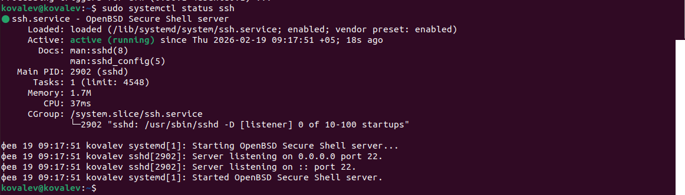

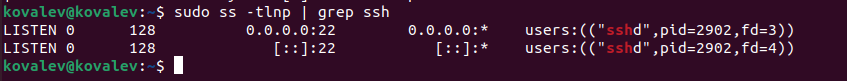

## 5. Пользователи и группы

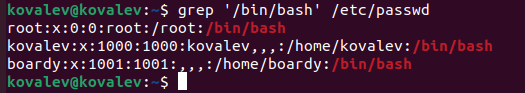

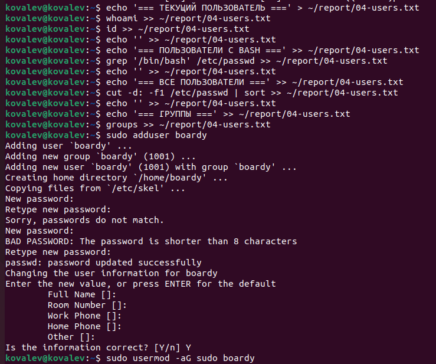

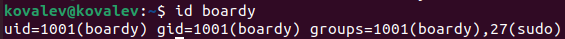

## 6. Дерево каталогов

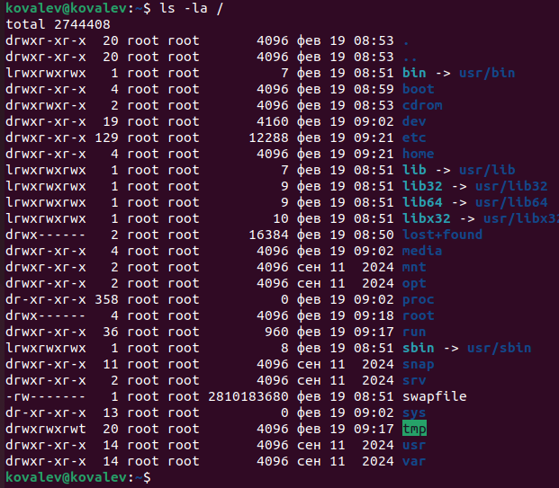

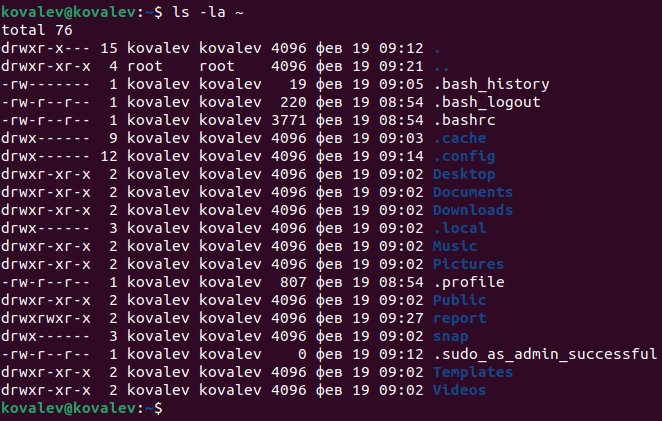

## 7. Права доступа

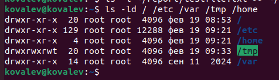

## 8. Установленные пакеты и сервисы

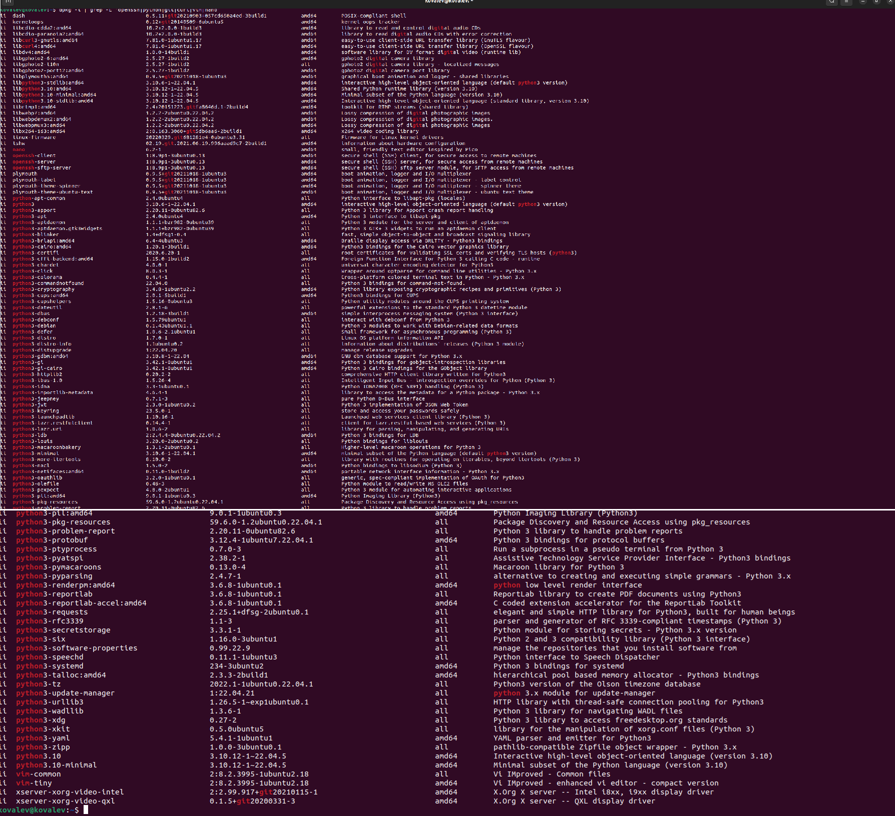

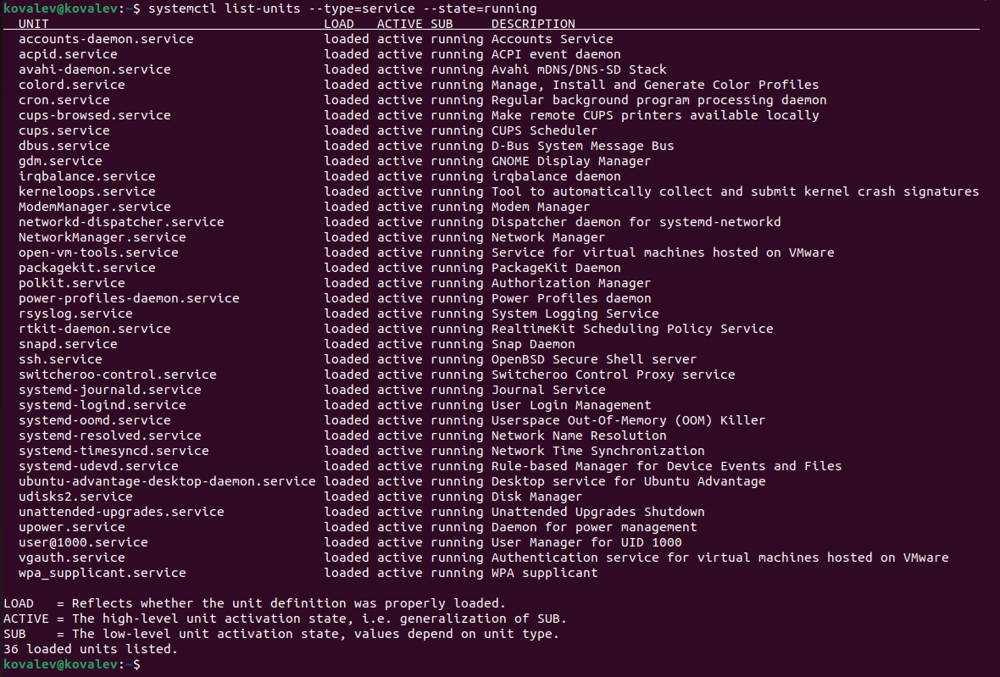

## 9. Конвейер и перенаправление

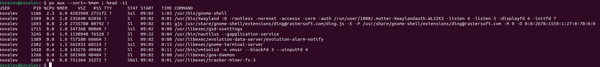

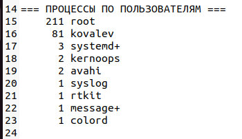

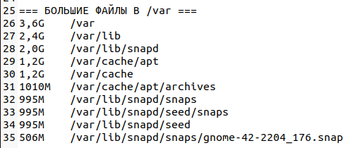

## 10. Итоговый файл

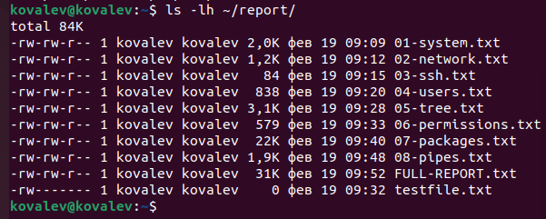

